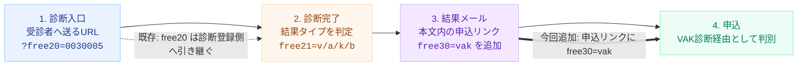

# VAK診断ツール判定の仕組み資料

この資料は、既存の `free20` 引き継ぎ仕様に加えて、今回新しく追加したい「VAK診断経由の申込だとわかる仕組み」を説明するためのものです。

追加するのは、診断入口URLではなく、診断後に届く結果メール本文内の「無料セミナー詳細・お申し込み」リンクです。

そのリンクに `free30=vak` を付けます。

## 今回追加すること

### 変更前

```text
https://pro-coach.net/p/r/8uCeXl3l?free20=0030005
```

申込リンクには施策IDの `free20` は付いているが、「VAK診断経由」という識別子は付いていない。

### 変更後

```text
https://pro-coach.net/p/r/8uCeXl3l?free20=0030005&free30=vak
```

`free30=vak` が追加されるため、無料セミナー申込データ側で「VAK診断経由」と判別できる。

## 全体図



図の緑部分が今回の追加対象です。既存の診断入口URLや、診断結果登録時の `free20` / `free21` の流れはそのままです。

```text
https://pro-coach.net/p/r/8uCeXl3l?free20=0030005&free30=vak
```

## 各パラメータの役割

| パラメータ | 役割 | 説明 |
| --- | --- | --- |
| `free20` | 施策ID | 例: `0030005`。診断URLに付けて配布し、診断完了後のメール登録時にも引き継ぐ既存のID。 |
| `free21` | 診断タイプ | 例: `v` / `a` / `k` / `b`。診断結果に応じて付く既存の分類値。 |
| `free30` | 経由元 | 今回追加する値。`free30=vak` を結果メールの申込リンクに付け、申込元がVAK診断だとわかるようにする。 |

## 追加する場所

| 対象 | 今回の扱い | 理由 |
| --- | --- | --- |
| 受診者に送る診断URL | `https://vak.apps.global-leaders-academy.co.jp/?free20=0030005` | 既存どおり。ここは診断入口なので、媒体・施策IDの `free20` を渡す。 |
| 結果画面のメール登録フォーム | `free20` と `free21` を送信 | 既存どおり。診断登録側では、流入IDと診断タイプを渡す。 |
| 結果メール本文の申込リンク | `free30=vak` を追加 | 今回の追加対象。メールを読んでセミナー申込した人が、VAK診断経由だと判別できる。 |

## 設定するURL

### 結果メール本文に載せる申込リンク

```text
https://pro-coach.net/p/r/8uCeXl3l?free20=0030005&free30=vak
```

### メール本文の表記例

```text
▼ 無料セミナーの詳細・お申し込みはこちら
https://pro-coach.net/p/r/8uCeXl3l?free20=0030005&free30=vak
```

## 確認ポイント

- 結果メール本文の申込リンクに `free30=vak` が付いていること。
- 既存の `free20=0030005` は消さずに残すこと。
- URLにパラメータを追加するため、`?` ではなく `&free30=vak` の形でつなぐこと。
- 申込側のマイスピー項目で `free30` が受け取れていること。

作成日: 2026-07-23

用途: VAK診断経由の申込識別追加案の説明資料
