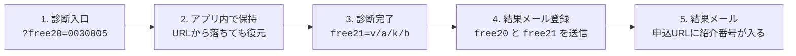

# VAK診断ツール判定の仕組み資料

この資料は、診断入口で受け取った紹介番号 `free20` と、診断結果タイプ `free21` をマイスピーへ正しく渡すための現在仕様を説明するものです。

重要なのは、受診者に送るURLの `free20=0030005` を、診断完了後のメール登録フォームまで空にせず引き継ぐことです。

## 今回修正すること

### 問題が起きていた状態

```text
https://vak.apps.global-leaders-academy.co.jp/?free20=0030005
```

上記URLで診断を開始しても、画面遷移の途中で `free20` がURLから落ちることがありました。

その状態で結果メール登録をすると、マイスピー側には紹介番号が空のまま登録され、結果メール本文の申込URLも次のように空欄になります。

```text
https://pro-coach.net/p/r/QoDWW0li?free20=
```

### 修正後

診断入口で受け取った `free20` をブラウザ内に一時保存し、質問画面・結果画面・メール登録フォームで復元します。

```text
https://pro-coach.net/p/r/QoDWW0li?free20=0030005
```

## 全体図



## 各パラメータの役割

| パラメータ | 役割 | 説明 |
| --- | --- | --- |
| `free20` | 紹介番号・施策ID | 例: `0030005`。診断URLに付けて配布し、結果メール登録時にもマイスピーへ送信する。 |
| `free21` | 診断タイプ | 例: `v` / `a` / `k` / `b`。診断結果に応じてマイスピーへ送信する。 |

## 確認ポイント

- 診断入口URLは `https://vak.apps.global-leaders-academy.co.jp/?free20=0030005` の形で送る。
- 「診断をはじめる」を押した後も、質問画面URLに `free20=0030005` が残る。
- 仮にURLから `free20` が落ちても、結果メール登録フォーム送信時に保存済みの `free20` を復元する。
- 結果メール本文の申込URLで `free20=` が空欄にならず、紹介番号が入る。

作成日: 2026-07-23

更新日: 2026-08-09

用途: VAK診断の紹介番号・診断タイプ引き継ぎ仕様の説明資料
