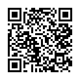
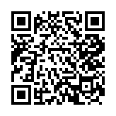
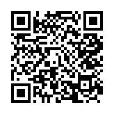

# 診断ツール一覧

## 共通の目的

- **ワイン会やビジネスシーンでの効果的なコミュニケーション**
- **コーチングセミナーへの招待**

すべての診断ツールは、ワイン会参加者が気軽に楽しみながら自己理解を深め、最終的にコーチングセミナーへの興味を持ってもらうことを目的とする。

---

## 📊 デプロイ済み診断ツール

### 1. ✅ VAK コミュニケーションタイプ診断
**URL**: https://coaching-kit.github.io/coaching-app/vak/  
**仕様書**: [doc/vak/仕様書.md](vak/仕様書.md)

**概要**: 個人のコミュニケーションスタイルを3つの感覚タイプ（Visual/Auditory/Kinesthetic）に分類

**質問数**: 12問

**タイプ**:
- Visual型（視覚型）
- Auditory型（聴覚型）
- Kinesthetic型（体感覚型）
- バランス型

**コード**: [src/vak_assessment_nextjs/](../src/vak_assessment_nextjs/)

---

### 2. ✅ コミュニケーションスタイル診断
**URL**: https://coaching-kit.github.io/coaching-app/communication/  
**仕様書**: [doc/communication/仕様書.md](communication/仕様書.md)

**概要**: ビジネスや人間関係での対人スタイルを4つのタイプに分類

**質問数**: 16問

**タイプ**:
- Driver型（推進型）
- Expressive型（表現型）
- Amiable型（協調型）
- Analytical型（分析型）
- バランス型

**コード**: [src/communication_style/](../src/communication_style/)

---

### 3. ✅ ワイン × VAK診断
**URL**: https://coaching-kit.github.io/coaching-app/winevak/  
**仕様書**: [doc/wine_vak/仕様書.md](wine_vak/仕様書.md)

**概要**: ワインの楽しみ方を通じて、コミュニケーションスタイル（VAK）を発見

**質問数**: 12問（ワイン版の質問）

**タイプ**:
- Visual型（視覚派）: ワインの色や見た目を重視
- Auditory型（聴覚派）: ソムリエの説明やストーリーを楽しむ
- Kinesthetic型（体感派）: 香りや味わい、体験を大切にする
- バランス型

**特徴**:
- ワインを通じて自然にコミュニケーションスタイルを発見
- ビジネス・コーチングへの活用アドバイスを提供
- ワイン会での話題づくりに最適

**コード**: [src/wine_vak/](../src/wine_vak/)

---

## 🔧 実装可能な診断ツール案

以下は、同じ技術スタックで追加実装できる診断ツールのアイデアです。用途やターゲットに応じて選択・カスタマイズが可能です。

### 4. 【優先度：高】モチベーションタイプ診断

**概要**: 何に動機づけられるかを3-4タイプで診断

**タイプ例**:
- **達成型**（Achievement）: 目標達成、成功、成長
- **関係型**（Affiliation）: 人間関係、つながり、協力
- **影響型**（Power/Impact）: 影響力、リーダーシップ、変化
- **自律型**（Autonomy）: 自由、独立、創造性

**ワイン会での活用**:
- 自分の価値観を知る
- キャリア選択の参考
- チームでの役割分担

**特徴**:
- キャリアコーチングとの相性◎
- 行動の理由を理解できる
- 12問、5段階評価

---

### 5. 【優先度：中】ストレングス診断

**概要**: 自分の強みを5-6カテゴリーで可視化

**カテゴリー例**:
- **戦略的思考**: 分析力、計画性、先見性
- **実行力**: 行動力、責任感、達成力
- **人間関係構築**: 共感力、コミュニケーション、協調性
- **影響力**: 説得力、リーダーシップ、プレゼン力
- **創造性**: アイデア、革新性、柔軟性

**ワイン会での活用**:
- ポジティブな自己紹介のネタ
- 相互の強みを認め合う
- 補完関係を発見

**特徴**:
- ポジティブで楽しい
- 自己肯定感が高まる
- 15-20問、5段階評価

---

### 6. 【優先度：中】リーダーシップスタイル診断

**概要**: リーダーとしてのスタイルを診断

**タイプ例**:
- **ビジョン型**: 将来像を示し、人を鼓舞する
- **コーチ型**: 育成を重視、対話を大切にする
- **民主型**: チームの意見を尊重、合意形成
- **先導型**: 率先垂範、自ら行動で示す

**ワイン会での活用**:
- マネジメント層に響く
- キャリアアップのヒント
- チームビルディング

**特徴**:
- ビジネス色強め（経営者・管理職向け）
- コーチングセミナーへの導線◎
- 12問、5段階評価

---

### 7. 【優先度：低】価値観診断

**概要**: 大切にしている価値観を可視化

**価値観例**:
- **成長・学び**: 自己成長、スキル向上、知識獲得
- **安定・安心**: 安定した生活、リスク回避
- **挑戦・刺激**: 新しい経験、変化、冒険
- **貢献・社会**: 社会貢献、人の役に立つ
- **自由・創造**: 自由な働き方、創造性

**ワイン会での活用**:
- 深い自己理解
- 価値観が合う人との交流
- ライフプラン設計

**特徴**:
- やや抽象的（導入は後回し推奨）
- キャリアコーチングとの相性◎
- 15問、5段階評価

---

### 8. 【ユニーク】ワインペアリング × 性格診断

**概要**: ワインの好みから性格や価値観を診断（エンタメ寄り）

**診断要素**:
- 好きなワインのタイプ（赤・白・スパークリング）
- 味の好み（フルボディ・ライト・甘口・辛口）
- 飲むシーン（パーティ・静かな場所・一人で）

**タイプ例**:
- **情熱の赤ワインタイプ**: 行動的、情熱的、社交的
- **知的な白ワインタイプ**: 繊細、洗練、論理的
- **華やかなスパークリングタイプ**: 明るい、楽しい、ポジティブ

**ワイン会での活用**:
- ワイン会のテーマに直結
- 話題性抜群
- アイスブレイクに最適

**特徴**:
- エンタメ性高い（科学的根拠は弱め）
- ワイン会専用
- 8-10問、選択式

---

## 🚀 実装の優先順位（参考）

### フェーズ1: 基本ラインナップ（VAK + 2種類）
1. ✅ **VAK診断**（既存）
2. ✅ **コミュニケーションスタイル診断**（実装済み）
3. ✅ **Wine × VAK診断**（実装済み）
4. 🔥 **モチベーションタイプ診断**（キャリア寄り）

**理由**: VAKが「感覚」、コミュニケーションスタイルが「対人関係」、Wine × VAKが「ワイン会向け」、モチベーションが「動機・価値観」と、異なる軸で自己理解を深められる

---

### フェーズ2: ビジネス強化（+1種類）
4. 💼 **リーダーシップスタイル診断**

**理由**: ビジネス・マネジメント層により刺さる内容

---

### フェーズ3: 深化と差別化（+2種類）
5. 💪 **ストレングス診断**（ポジティブで楽しい）
6. 🍷 **ワインペアリング × 性格診断**（エンタメ性）

**理由**: 差別化と話題性

---

## 📊 診断ツール比較表

### デプロイ済み診断

| 診断名 | ステータス | ビジネス性 | 楽しさ | 科学性 | 質問数 | コーチング親和性 |
|--------|-----------|-----------|--------|--------|--------|-----------------|
| VAK診断 | ✅ 本番稼働 | ⭐⭐⭐⭐ | ⭐⭐⭐ | ⭐⭐⭐⭐ | 12問 | ⭐⭐⭐⭐ |
| コミュニケーションスタイル | ✅ 本番稼働 | ⭐⭐⭐⭐⭐ | ⭐⭐⭐ | ⭐⭐⭐⭐ | 16問 | ⭐⭐⭐⭐⭐ |
| Wine × VAK | ✅ 本番稼働 | ⭐⭐⭐ | ⭐⭐⭐⭐⭐ | ⭐⭐⭐⭐ | 12問 | ⭐⭐⭐⭐ |

### 実装可能な診断（参考）

| 診断名 | 優先度 | ビジネス性 | 楽しさ | 科学性 | 質問数 | コーチング親和性 |
|--------|--------|-----------|--------|--------|--------|-----------------|
| モチベーションタイプ | 高 | ⭐⭐⭐⭐ | ⭐⭐⭐⭐ | ⭐⭐⭐⭐ | 12問 | ⭐⭐⭐⭐⭐ |
| ストレングス診断 | 中 | ⭐⭐⭐⭐ | ⭐⭐⭐⭐⭐ | ⭐⭐⭐ | 18問 | ⭐⭐⭐⭐ |
| リーダーシップスタイル | 中 | ⭐⭐⭐⭐⭐ | ⭐⭐⭐ | ⭐⭐⭐⭐ | 12問 | ⭐⭐⭐⭐⭐ |
| 価値観診断 | 低 | ⭐⭐⭐ | ⭐⭐⭐ | ⭐⭐⭐ | 15問 | ⭐⭐⭐⭐⭐ |
| ワインペアリング診断 | - | ⭐⭐ | ⭐⭐⭐⭐⭐ | ⭐⭐ | 10問 | ⭐⭐ |

---

## 💡 次のステップ

1. **どの診断から作るか決定**
   - 推奨: コミュニケーションスタイル診断
   
2. **詳細仕様書の作成**
   - VAK診断の仕様書をテンプレートに
   
3. **質問設計**
   - 各タイプ3-4問ずつ
   - 5段階評価
   
4. **開発・デプロイ**
   - 同じNext.js構成で展開

5. **カスタムドメインの設定（オプション）**
   - 独自ドメインでの公開も可能

---

## 📝 メモ

- すべての診断は「自己理解 → コミュニケーション改善 → コーチングセミナー」の流れ
- 診断結果画面に必ず同じセミナーURLを掲載
- モバイルファースト、5-10分で完了
- 結果はメール送信可能

---

## 🌐 カスタムドメインについて（オプション）

現在は `coaching-kit.github.io/coaching-app/` というURLでアプリを公開していますが、必要に応じて独自ドメイン（例: `www.your-coaching-tools.com`）を設定することもできます。

**カスタムドメインとは？**  
お名前.comやムームードメインなどで取得した独自のドメイン名を使って、アプリにアクセスできるようにする設定です。

**メリット**
- 覚えやすく、共有しやすいURL
- ブランディング効果（自社/自分のドメインで提供）
- よりプロフェッショナルな印象

**設定の流れ**
1. ドメイン取得サービスでドメインを購入
2. DNSの設定を変更（技術チームに依頼）
3. GitHub Pagesの設定画面でドメインを登録
4. HTTPS（セキュア通信）を有効化

